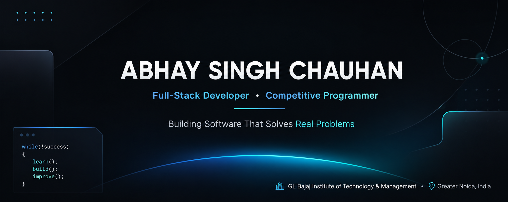

 

<h1>ABHAY SINGH CHAUHAN</h1>

<strong>FULL-STACK DEVELOPER</strong> &nbsp;·&nbsp; <strong>SOFTWARE ENGINEERING STUDENT</strong> &nbsp;·&nbsp; <strong>COMPETITIVE PROGRAMMER</strong>

  

 

 

## About

I'm a Computer Science undergraduate at GL Bajaj Institute of Technology & Management, currently holding an 8.69 CGPA. My focus sits at the intersection of full-stack engineering and algorithmic problem-solving — I'd rather deeply understand how a system works than collect frameworks.

Most of my time goes into two things: shipping MERN applications with real backend logic behind them, and working through data structures and algorithms with consistency rather than bursts. I've solved 400+ problems on that front, and I'm currently moving into system design to understand how the pieces I build fit into something larger.

I learn in public — through cloud certifications, virtual experience programs from companies like JPMorgan Chase and AWS, and projects that are small in scope but built properly end to end.

 

## Current Focus

<table>
<tr>
<td width="50%" valign="top">

**Building**
- Full-stack applications on the MERN stack
- REST APIs with proper auth and data modeling
- Backend systems that don't fall over under real use

</td>
<td width="50%" valign="top">

**Learning**
- System design fundamentals
- Competitive programming (daily DSA practice)
- Cloud-native development patterns

</td>
</tr>
</table>

 

## Tech Arsenal

<table>
<tr>
<td valign="top" width="33%">

**Languages**

</td>
<td valign="top" width="33%">

**Frontend**

</td>
<td valign="top" width="33%">

**Backend**

</td>
</tr>
<tr>
<td valign="top" width="33%">

**Database**

</td>
<td valign="top" width="33%">

**Cloud & Platforms**

</td>
<td valign="top" width="33%">

**Tooling**

</td>
</tr>
<tr>
<td valign="top" colspan="3">

**Currently Learning**

</td>
</tr>
</table>

 

## Featured Projects

<table>
<tr>
<td width="50%" valign="top">

### Sorting Algorithm Visualizer

Interactive visualizer for Bubble Sort, Merge Sort, and Quick Sort — animated bars, a side-by-side comparison mode, and a live time-complexity graph so the trade-offs are visible, not just stated.

`JavaScript` `HTML5` `CSS3`

</td>
<td width="50%" valign="top">

### Striver SDE Sheet — Solutions

Complete, optimized C++ solutions to Striver's SDE Sheet, with progress tracked daily rather than solved in batches. Spans arrays, trees, graphs, dynamic programming, and binary search.

`C++` `DSA`

</td>
</tr>
<tr>
<td width="50%" valign="top">

### JPMC Software Engineering Simulation

JPMorgan Chase's Advanced Software Engineering virtual experience — building components of a financial data processing system in Java, modeled on real engineering tasks used internally at JPMC.

`Java` `Financial Systems`

</td>
<td width="50%" valign="top">

### DSA & OOPS — Summer Assignment

A structured 4-week problem set covering core data structures, algorithms, and object-oriented design principles, solved in C++ as part of a focused summer practice track.

`C++` `OOPS` `DSA`

</td>
</tr>
</table>

 

## Achievements

<table>
<tr><td>🏅</td><td><strong>Salesforce Agentblazer Champion 2026</strong></td></tr>
<tr><td>🧠</td><td><strong>400+ DSA problems solved</strong> across arrays, trees, graphs, DP, and binary search</td></tr>
<tr><td>🤝</td><td><strong>Internshala Student Partner</strong></td></tr>
<tr><td>📈</td><td><strong>8.53 CGPA</strong> in B.Tech Computer Science</td></tr>
</table>

 

## Certifications

**2026**
- Salesforce Agentblazer Champion 2026
- Oracle Cloud Infrastructure Foundations Associate
- AWS Academy Cloud Foundations
- AWS Solutions Architecture — Virtual Experience
- Google Cloud — Introduction to Generative AI Studio

**2025**
- Software Engineering Virtual Experience — JPMorgan Chase
- AR/VR Immersive Technologies Program

 

## GitHub Analytics

 

 

 

##  LeetCode

 

## Contribution Graph

 

 

## Connect

 

Building things that work, one commit at a time.

